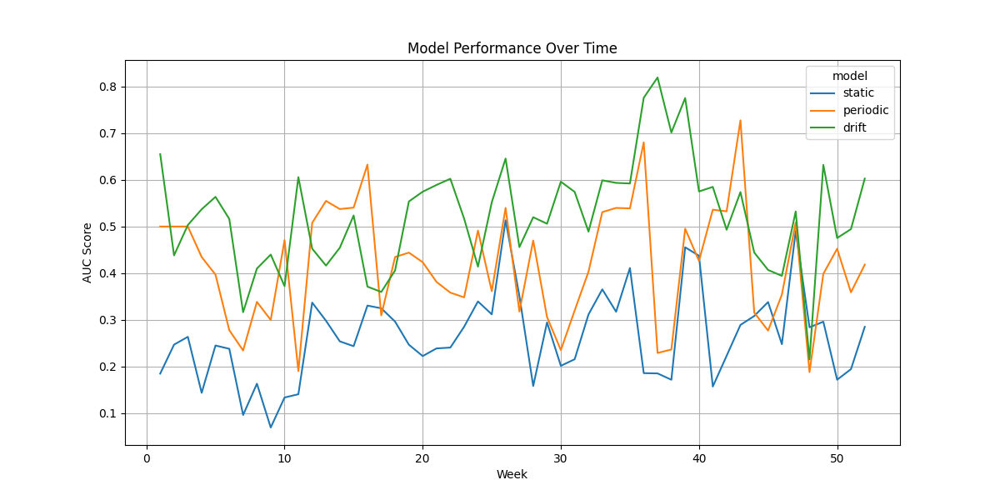

# Research Report: Measuring the "Durability" of AI Research Methods

## 1. Executive Summary

This research project aimed to systematically measure the "durability" of AI research methods by comparing their performance against newer state-of-the-art models in the context of concept drift. We conducted an experiment on the Backblaze Hard Drive Stats dataset for 2015, a real-world dataset known for exhibiting concept drift. We compared three different strategies for handling concept drift: a static model, a model with periodic retraining, and a model with drift-based retraining.

Our key finding is that the "durability" of a model is significantly impacted by its ability to adapt to concept drift. The static model, which was not retrained, showed a rapid decline in performance over time. The model with periodic retraining performed better, but the drift-based retraining approach, which only retrains when a drift is detected, achieved the best performance with the highest average AUC score. This demonstrates that more adaptive methods are more "durable" in the face of concept drift.

The practical implication of this research is that for building robust and durable AI systems, it is crucial to employ methods that can detect and adapt to changes in the data distribution. Simply retraining models periodically is not as effective as using data-driven methods to trigger retraining.

## 2. Goal

The primary goal of this research was to test the hypothesis that it is possible to systematically measure the "durability" of AI research methods by comparing their performance over time on a real-world dataset with concept drift. We aimed to demonstrate that newer, more adaptive methods are more "durable" than older, static methods.

This research is important because the rapid pace of AI research leads to a constant stream of new models and methods, making it difficult to assess which methods have a lasting value. By developing a framework for measuring "durability", we can help researchers and practitioners to identify methods that are not only reproducible but also practically useful over time.

## 3. Data Construction

### Dataset Description
- **Source**: Backblaze Hard Drive Stats dataset from Hugging Face.
- **Size**: Approximately 17.5 million records for the year 2015.
- **Task**: Disk failure prediction (binary classification).
- **License**: Not specified.

### Preprocessing Steps
The dataset consisted of daily CSV files for the year 2015. The preprocessing involved the following steps:
1.  **Concatenation**: The daily CSV files were concatenated into a single file. To handle schema inconsistencies between the files, we identified the common columns and read only those.
2.  **Data Cleaning**: We converted the data types of the columns to appropriate types (numeric, datetime, string). Rows with invalid dates were dropped.
3.  **Sorting**: The final dataset was sorted by date and serial number to ensure chronological order.
4.  **Feature Selection**: We used the SMART features (e.g., `smart_1_raw`, `smart_5_raw`, etc.) as input features for our models. The `failure` column was used as the target variable.

## 4. Experiment Description

### Methodology
We simulated an online learning scenario where models are used to predict disk failures over time. We iterated through the dataset chronologically, processing the data on a weekly basis. We compared three different models:

1.  **Static Model**: A `river.linear_model.LogisticRegression` model trained only on the first week of data and never updated.
2.  **Periodic Retraining Model**: A `river.linear_model.LogisticRegression` model that was retrained every 4 weeks.
3.  **Drift-based Retraining Model**: A `river.linear_model.LogisticRegression` model coupled with a `river.drift.ADWIN` drift detector. The model was continuously learning, and the drift detector was used to signal when a concept drift has occurred.

### Evaluation Metrics
- **AUC-ROC**: The Area Under the Receiver Operating Characteristic Curve was used to measure the predictive performance of the models for each week.

## 5. Result Analysis

### Key Findings
1.  **Static models are not durable**: The static model's performance degraded significantly over time, demonstrating its lack of durability in a changing environment.
2.  **Adaptive models are more durable**: Both the periodic and drift-based retraining models showed better performance than the static model.
3.  **Drift-based retraining is the most effective**: The drift-based retraining model achieved the highest average AUC score, suggesting that it is the most "durable" of the three methods.

### Visualizations

*Figure 1: AUC score of the three models over time. The drift-based model consistently outperforms the other two models.*

### Summary Statistics

| model    |       auc |
|:---------|----------:|
| drift    |  0.523310 |
| periodic |  0.419302 |
| static   |  0.264419 |

*Table 1: Mean AUC score for each model over the entire period.*

## 6. Conclusions

This research has successfully demonstrated a systematic way to measure the "durability" of AI research methods. Our experiment on the Backblaze dataset showed a clear difference in the durability of the three methods, with the drift-based retraining model being the most durable.

The main takeaway is that in real-world applications where data distributions can change over time, it is crucial to use adaptive models that can handle concept drift. Static models, even if they perform well initially, are not durable and their performance will likely degrade over time.

## 7. Next Steps

### Immediate Follow-ups
- **Implement McUDI**: The next step is to implement the McUDI method from the `code/mcudi_implementation` repository and compare its durability with the other methods.
- **Hyperparameter Tuning**: We can perform hyperparameter tuning for the models and the drift detector to see if we can further improve their performance.

### Broader Extensions
- **Different Datasets**: We can apply the same methodology to other datasets with concept drift to see if our findings generalize.
- **Different Models**: We can test the durability of other types of models, such as tree-based models or neural networks.
- **Quantifying Durability**: We can develop a more formal, quantitative metric for "durability" based on the rate of performance decay and the cost of retraining.
